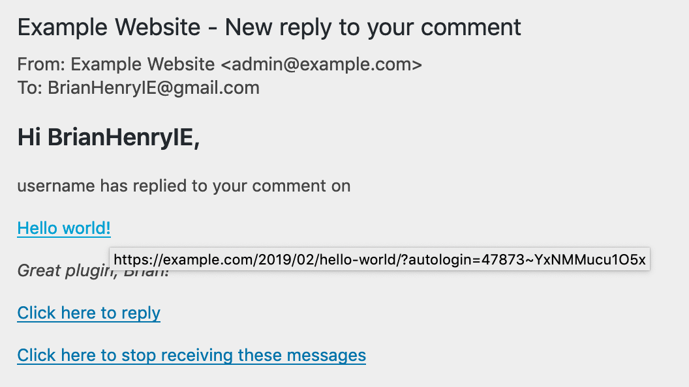
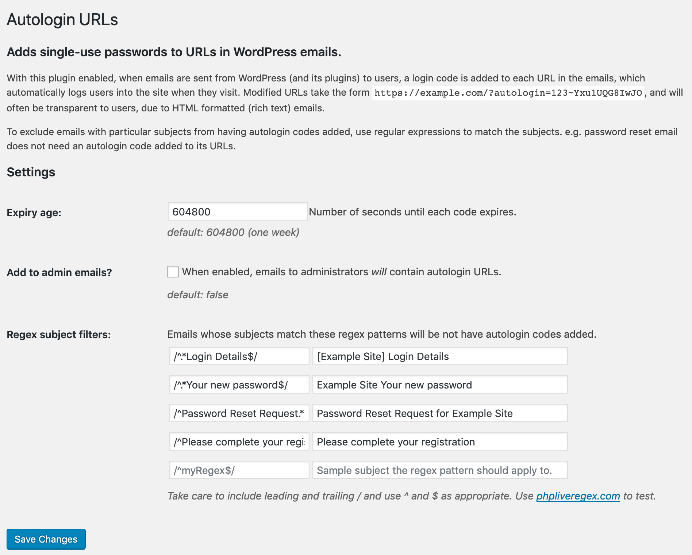

[](https://wordpress.org/plugins/bh-wp-autologin-urls) [](https://github.com/WordPress-Coding-Standards/WordPress-Coding-Standards) [](https://www.gnu.org/licenses/old-licenses/gpl-2.0.en.html) []()

# Autologin URLs

Adds single-use passwords to WordPress emails' URLs for frictionless login.

## Overview

This plugin hooks into the `wp_mail` filter to augment existing URLs with login codes so users are automatically logged in when visiting the site through email links.

It is in use for a charity whose annual requests for donations to non-tech-savvy users was resulting in users unable to remember their password. Now those users are instantly logged in.

It should also help solve the problem with WooCommerce abandoned cart emails where the user must be logged in to know _who_ abandoned the cart.

Also useful for logging users back in when they get reply notifications for their comments, bbPress posts etc.

This plugin makes no theme/user-facing changes.


Example email sent via [Comment Reply Email Notification](https://wordpress.org/plugins/comment-reply-email-notification/) plugin.

## Installation & Configuration

Install `Autologin URLs` from [the WordPress plugin directory](https://wordpress.org/plugins/bh-wp-autologin-urls).

There is no configuration needed. By default:

* Codes expire after seven days
* Emails to admins do not get autologin codes added
* Some emails are filtered out by subject using regex

The settings page can be found in the admin UI under `Settings`/`Autologin URLs`, as a link on the Plugins page, or at `/wp-admin/options-general.php?page=bh-wp-autologin-urls`.



## Operation

* Hooked on `wp_mail`
* Login code consists of user id and random alphanumeric password separated by `~`
* Stored in WordPress database hashed as a transient with an expiration time
* Deleted after a single use

Links take the form: `https://brianhenry.ie/?autologin=582~Yxu1UQG8IwJO`

### Secure

The plugin conforms to all the suggesitions in the StackExchange discussion, [Implementing an autologin link in an email](https://security.stackexchange.com/questions/129846/implementing-an-autologin-link-in-an-email):

* Cryptographically Secure PseudoRandom Number Generation (via [wp_rand](https://core.trac.wordpress.org/ticket/28633))
* Stored as SHA-256 hash
* Codes are single use
* Codes automatically expire

Additionally, authentication via Autologin URLs is disabled for 24 hours for users whose accounts have had five failed login attempts through an autologin URL and for IPs which have attempted and failed five times.

**Warning:** *If you use any plugin to save copies of outgoing mail, those saved emails will contain autologin URLs.*

### Performant

* The additional rows added as transients to the `wp_options` table will be proportionate to the number of emails sent
* Additional database queries only occur when a URL with `autologin=` is visited
* No database queries are performed if the autologin user is already logged in
* Transients are queried by `wp_options.option_name` which is a [UNIQUE](http://www.mysqltutorial.org/mysql-unique-constraint/) column, i.e. indexed
* Transients are deleted when they are used to login
* WordPress, [since v4.9](https://core.trac.wordpress.org/ticket/41699#comment:17), automatically purges expired transients

## API

Two filters are added to expose the main functionality to developers of other plugins (which don't use `wp_mail()`), e.g. for push notifications:

```
$url = apply_filters( 'add_autologin_to_url', $url, $user );
```
```
$message = apply_filters( 'add_autologin_to_message', $message, $user );
```

Filters to configure the expiry time, admin enabled setting and subject exclusion regex list are defined in the `BH_WP_Autologin_URLs\wp_mail\WP_Mail` class.

Instances of classes hooked in actions and filters are exposed as properties of `BH_WP_Autologin_URLs` class, accessible with:

```
/** @var BH_WP_Autologin_URLs\includes\BH_WP_Autologin_URLs $autologin_urls */
$autologin_urls = $GLOBALS['bh-wp-autologin-urls'];
```

[API functions](https://github.com/BrianHenryIE/BH-WP-Autologin-URLs/blob/master/trunk/api/interface-api.php) can be accessed through the `api` property of the main plugin class:

```
/** @var BH_WP_Autologin_URLs\api\API_Interface $autologin_urls_api */
$autologin_urls_api = $GLOBALS['bh-wp-autologin-urls']->api;
```

## Develop

The plugin uses [WordPress Plugin Boilerplate](https://github.com/DevinVinson/WordPress-Plugin-Boilerplate), [WordPress Coding Standards](https://github.com/WordPress-Coding-Standards/WordPress-Coding-Standards) and [wp-namespace-autoloader](https://github.com/pablo-sg-pacheco/wp-namespace-autoloader/). The code has been tested using WordPress 5.2 on PHP 7.1.

To install [PHP_CodeSniffer](https://github.com/squizlabs/PHP_CodeSniffer), the  [WordPress Coding Standards](https://github.com/WordPress-Coding-Standards/WordPress-Coding-Standards), [WP_Mock](https://github.com/10up/wp_mock) (and its [PHP Unit 7](https://github.com/sebastianbergmann/phpunit) dependency) and wordpress-develop testing environment run:

```
composer install
```

### WordPress Coding Standards

The code mostly conforms to WPCS rules, except for :

* `Squiz.PHP.DisallowMultipleAssignments.Found` used when making the plugin's hooked objects public for other plugins
* `WordPress.Security.NonceVerification.Recommended` when validating the autologin code to log the user in
* `WordPress.DB.DirectDatabaseQuery.DirectQuery` and `WordPress.DB.DirectDatabaseQuery.NoCaching` when deleting in uninstall.php 
* `WordPress.Files.FileName.InvalidClassFileName` for abstract classes

Some other rules are disabled in the test code.

To see WordPress Coding Standards errors run:

```
vendor/bin/phpcs
```

To automatically correct them where possible run:

```
vendor/bin/phpcbf
```

### WP_Mock Tests

WP_Mock tests can be run with:

```
phpunit -c tests/wp-mock/phpunit.xml
```

### WordPress-Develop Tests

The wordpress-develop tests are configured to require a local [MySQL database](https://dev.mysql.com/downloads/mysql/) (which gets wiped each time) and this plugin is set to require a database called `wordpress_tests` and a user named `wordpress-develop` with the password `wordpress-develop`. 

To setup the database, open MySQL shell:

```
mysql -u root -p
```

Create the database and user, granting the user full permissions:

```
CREATE DATABASE wordpress_tests;
CREATE USER 'wordpress-develop'@'%' IDENTIFIED WITH mysql_native_password BY 'wordpress-develop'
GRANT ALL PRIVILEGES ON wordpress_tests.* TO 'wordpress-develop'@'%';
```

```
quit
```

The wordpress-develop tests can then be run with:

```
phpunit -c tests/wordpress-develop/phpunit.xml 
```

### Code Coverage

Code coverage reporting requires [Xdebug](https://xdebug.org/) installed.

Adding `--coverage-text` to `phpunit` commands displays their individual coverage in the console. 

Adding `--coverage-php tests/reports/wordpress-develop.cov` to each allows their coverage stats to be merged using:

```
vendor/bin/phpcov merge --clover tests/reports/clover.xml --html tests/reports/html tests/reports
```
 
### All Together

To fix WPCS fixable errors, display the remaining, run WP_Mock and WordPress-develop test suites and output code coverage, run:

```
vendor/bin/phpcbf; 
vendor/bin/phpcs; 
phpunit -c tests/wordpress-develop/phpunit.xml --coverage-php tests/reports/wordpress-develop.cov --coverage-text; 
phpunit -c tests/wp-mock/phpunit.xml --coverage-php tests/reports/wp-mock.cov --coverage-text; 
vendor/bin/phpcov merge --clover tests/reports/clover.xml --html tests/reports/html tests/reports --text
```

Code coverage will be output in the console, and as HTML under `/tests/reports/html/`.

### Minimum PHP Version

[PHPCompatibilityWP](https://github.com/PHPCompatibility/PHPCompatibilityWP) is installed by Composer to check the minimum PHP version required. 

```
./vendor/bin/phpcs -p ./trunk --standard=PHPCompatibilityWP --runtime-set testVersion 5.7-
```

### Minimum WordPress Version

The minimum WordPress version was determined using [wpseek.com's Plugin Doctor](https://wpseek.com/pluginfilecheck/).

## TODO

* Regex for URLs with trailing brackets e.g. "(https://example.org)" 
* Remove the autologin URL parameter in the browser location bar on success
* Verify i18n is applied everywhere __()
* Delete all passwords button in admin UI
* Regex subject filters should be verified with `preg_match()` before saving
* Error messages on settings page validation failures
* Sanitize out regex pattern that would entirely disable the plugin
* Client-side settings page validation

## Licence

GPLv2 or later.